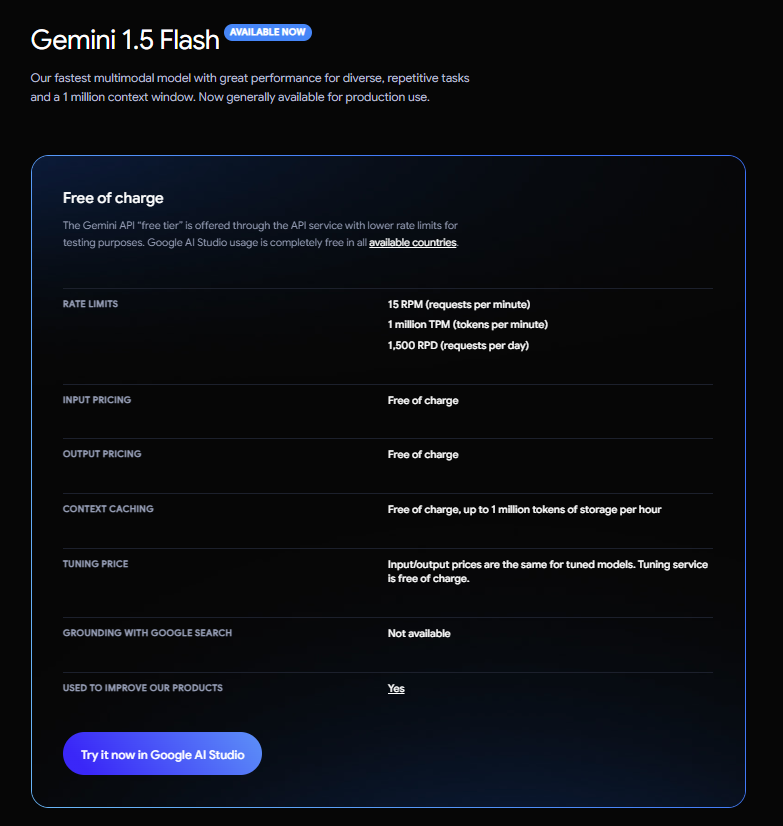

## This code sample using Google Cloud Vision API to explain information about the file (pdf, docx)
- Using pdfplumber to extract text from pdf file
- Using docx2txt to extract text from docx file

- Then using Google Cloud Vision API to extract information from the text

## install the package
`pip install -e requirements.txt`

## Run the code
```python
from GeminiAI import GeminiAI
from ResumeParser import ResumeParser

# Create an instance of GeminiAI
model_name = 'name of the model you want to use'
api_key = 'your google cloud vision api key'
gemini = GeminiAI(api_key=api_key, model_name=model_name)

# Create an instance of ResumeParser
resume_parser = ResumeParser(gemini)

# Extract information from a file (pdf, docx)
path_file = 'path to the file'
explanation = resume_parser.parse_resume(path_file)
print(explanation)
```

## How to get the Google Cloud Vision API key
- get api key from https://console.cloud.google.com/apis/credentials or https://aistudio.google.com/app/apikey
- 